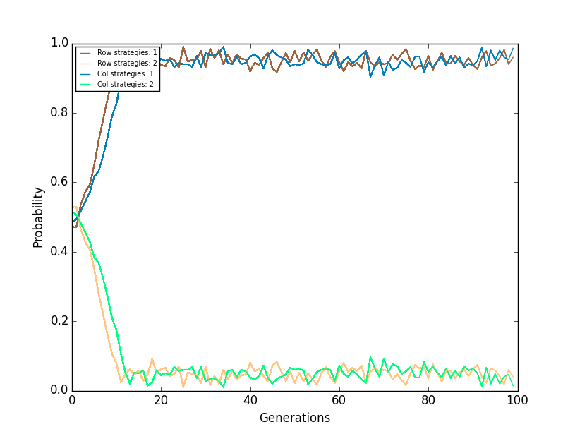
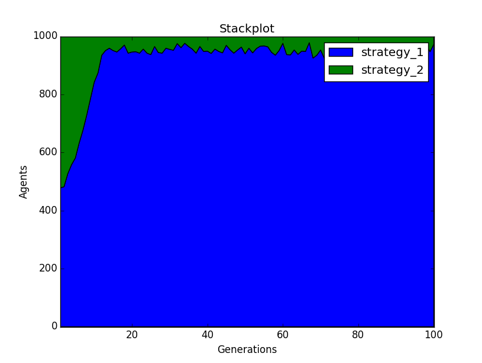

Ablearn package
===============
The current version of ``ablearn`` uses a genetic algorithm to solve the normal form games in an environment where agents interact randomly between each other.

-------------
Installing
-------------

To use ablearn, the first requirement is to have Python installed in your computer.

--------------------------
Using `ablearn` in Python
--------------------------
The first step after installing, is to open the Python IDE. And import ablearn
package::

    >>> import ablearn

After this the package has been successfully imported and ready to use. The way use it is very simple and relatively easy to understand. User should first create an instance of ``class Simulation``. And this instance is created as follows::

    >>> axl = ablearn.Simulation('tog', na, ge, rpg, dr, mr, er, isd)

As it can be seen, there are certain attributes that the ``class Simulation`` takes.

In the first position is ``tog`` means **type of game** is used to select one of five matrices for games already predetermined in the package and the selected option should go within single quotation marks as the previous example. The available options are:

1. ``pd`` for prisoner's dilemma matrix.
2. ``mp`` for matching pennies matrix.
3. ``bos`` for battle of sexes matrix.
4. ``hd`` for hawk-dove matrix.
5. ``psr`` for paper-scissors-rock matrix.
6. ``sh`` for stag hunt matrix.
7. ``axl`` for a matrix produced with **axelrod**'s package reprenting payoffs from Axelrod's tournament.
8. ``axlbasic`` for a matrix produced with **axelrod**'s package representing payoff of basic strategies from the package.

The variable ``na`` stands for **number of agents**, and it is the number of agents that will be created to interact. The number will be divided by 2 and that way it creates half of the population ``row_agents`` and the other half ``col_agents``.

The variable ``ge`` stands for **generations**, and it is the number of times the whole simulation will run.

The variable ``rpg`` stands for **rounds per generation**, and it is the number of interactions between the two types of agents that will occur on each generation.

The variable ``dr`` stands for **death rate**, and it is the number of agents that will be eliminated each generation. Since the population is set to be constant, the exact number of agents eliminated will be created so they can interact in the next generation. Another important thing is that the criteria that considers which agents will reproduce for the next generation, depends on the two following rates: **mutation** and the **exploitation**. The **mutation rate** takes values from **0** to **1**.

The variable ``mr`` stands for **mutation rate**, and it will allow any strategy to reproduce  occasionally. When the **mutation rate** is applied during the simulation it will also impede the agent strategy with the highest accummulated utility to reproduce. This rate takes values from **0** to **1**.

The variable ``er`` stands for **exploitation rate**, and this variable will is to indicate if it desirable to explore the output where only the agents (row and col) with the highest accumulated will be able to reproduce. With a lower rate it means that the percentage of the population that can be selected to reproduce is higher i.e. an ``er`` = 0.8 will allow 20% of the population to have equal probability of reproducing. It is important to mention that the population will be sorted from lowest to highest accumulated utility, so the 20% allowed to reproduce in this example is the 20% with the highest accumulated utility.

The variable ``isd`` stands for  **initial strategy distribution**, and it is used to select the initial proportions for each type of strategy that will be present in the population (represented by row and col agents). The format to introduce this variable is within ``[ ]``, the values within brackets will be separated by a comma and should add up to 1. An example is if we have a game where there are 2 available strategies like in **prisoner's dilemma** (Cooperate and Defect), it should be introduced [0.7, 0.3] and this means that when the simulation starts 70% of the population will **cooperate** and the remaining 30% will **defect**. The following will allow the user to know the order of the strategies in each game:

1. ``pd`` [Cooperate, Defect].
2. ``mp`` [Heads, Tails].
3. ``bos`` [Opera, Football].
4. ``hd`` [Hawk, Dove].
5. ``psr`` [Paper, Scissors, Rock].
6. ``sh`` [Stag, Hare]
7. ``axl`` [Tit for Tat, Grofman, Shubik, Grudger, Davis, Feld, Joss, Tullock].
8. ``axlbasic`` [Alternator, Cooperator, Defector, Random, Tit For Tat]

After creating the instance, the method ``run`` is used to run the simulation. The method can produce a plot that shows how the different agents with a certain strategy behave during the simulation and the variable name is ``plot``. For this ``plot`` the **y axis** represents the proportions of the different types of agents with the type of strategy they have and in the **x axis** is the number of the generation. The method can also build a stack plot, in which the user can see how the strategies behaved and the variable name is ``stack``. In the ``stack`` plot the **y axis** represents the number of strategies present in the simulation, and in the **y axis** the generations.
This is how the user should introduce the method if she desires to view both plots::

    >>> axl.run(plot=True, stack=True)

The following is an example of how the ``plot`` will be shown.

The following is an example of how the ``stack`` plot will be shown.

If the user does not wish to view the plots, no values are required to be introduced::

    >>> axl.run()

When running the module, the code the user will introduce should look something similar to::

    >>> import ablearn
    >>> axl = ablearn.Simulation('tog', na, ge, rpg, dr, mr, er, isd)
    >>> axl.run(plot=True, stack=True)

When running in the command line, the proportions for each strategy classified in the type of agent of each generation will be displayed.
